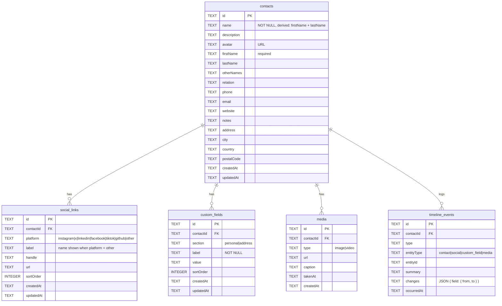
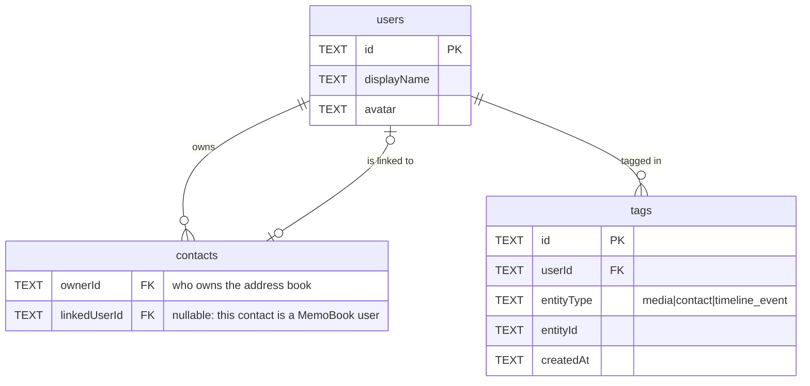

# MemoBook Backend

Node.js + TypeScript + Express 5 + SQLite backend for MemoBook, a demo contact book. There's no auth: anyone using the demo can add and edit contacts. The mock contacts are only seeded into an empty database.

## Run locally

```bash
npm install
npm run dev    # `node --watch` on http://localhost:3000 (seeds an empty DB on startup)
npm start      # same without auto-reload (used on Railway)
npm run seed   # seed only (skips if contacts already exist)
npm test       # run the test suite
npm run typecheck   # type check only (tsc, no output files)
```

Requires Node 22.18 or newer: Node strips the TypeScript types at runtime, so there is no build step.

The local database is `contacts.db` (gitignored). Delete it to start fresh with the mock data.

To run the full app locally, use two terminals:

1. `memobook-backend`: `npm run dev`
2. `memobook-frontend`: `npm run dev`, with `VITE_API_BASE_URL=http://localhost:3000` in the frontend `.env`

Then open http://localhost:5173.

CORS allows `http://localhost:3001` and `http://localhost:5173` by default. Set `ALLOWED_ORIGINS` (comma-separated) to override it, which production does.

Image uploads need `CLOUDINARY_CLOUD_NAME`, `CLOUDINARY_API_KEY` and `CLOUDINARY_API_SECRET` (Cloudinary Console → Settings → API Keys). Locally, copy `.env.example` to `.env` and fill them in; `npm run dev` loads it. Without them the signature endpoint returns 503 and everything else still works.

## Uploads (Cloudinary)

The browser uploads files straight to Cloudinary; the backend only signs the request, so the API secret never leaves the server and large videos never pass through it. The backend chooses the folder and public id, so a client can't write anywhere else in the account.

1. `POST /contacts/:id/uploads/signature` with `{ "kind": "avatar" | "media" }` returns `{ uploadUrl, apiKey, signature, params }`.
2. The client POSTs `file`, every entry of `params`, `api_key` and `signature` as form data to `uploadUrl`.
3. The client saves the returned `secure_url`: `PUT /contacts/:id { "avatar": url }` for a profile picture.

Assets are grouped per contact:

```
memobook/contacts/{contactId}/avatar        profile picture, overwritten on every re-upload
memobook/contacts/{contactId}/media/{uuid}  Media tab images and videos (endpoint to save them not built yet)
```

## Project structure

Code is grouped by feature. Each feature folder owns its routes, service (database logic) and validation.

```
src/
  server.ts              entry point: open DB → migrate → start app
  app.ts                 createApp(db): CORS, JSON, routers, error handler
  config.ts              PORT, ALLOWED_ORIGINS, DB path, Cloudinary credentials
  db/
    connection.ts        createDb(file): promise wrappers + withTransaction
    migrations.ts        versioned schema (PRAGMA user_version)
    seed.ts / seedData.ts   mock contacts for an empty DB
  lib/                   HttpError, field helpers, sortOrder
  contacts/              contacts.routes.ts, contacts.service.ts, contacts.validation.ts
  socials/               socials.routes.ts, socials.service.ts, socials.validation.ts
  customFields/          customFields.routes.ts, customFields.service.ts, customFields.validation.ts
  timeline/              timeline.routes.ts, timeline.service.ts (logEvent, diff)
  media/                 media.routes.ts (placeholder)
  uploads/               uploads.routes.ts, uploads.service.ts (Cloudinary signatures), uploads.validation.ts
tests/                   Vitest + supertest, one file per feature (plus db/, lib/)
```

The database is passed in (`createApp(db)`, `service(db, ...)`) rather than imported, so every test gets its own in-memory SQLite database.

## Testing

```bash
npm test               # run once
npm run test:watch     # re-run on change
npm run test:coverage  # with coverage report (HTML in coverage/)
```

Tests use [Vitest](https://vitest.dev) and [supertest](https://github.com/ladjs/supertest) against a fresh `:memory:` database per test, so they never touch `contacts.db`. Coverage must stay above 90% lines/functions/statements and 85% branches, or the run fails.

GitHub Actions (`.github/workflows/test.yml`) runs `npm run test:coverage` on every commit pushed to a pull request and on every push to `master`.

## Data model



- **contacts**: the core details shown on the Details tab. `firstName` is required. `name` is always built by the API as `firstName + " " + lastName` (used for display, search and sorting), and a `name` sent by the client is ignored.
- **social_links**: the Socials section. A custom social (Twitch, Etsy, and so on) uses `platform = "other"` plus a `label`.
- **custom_fields**: user-defined label/value rows added with "+ Add Field" under the Personal or Address section.
- **timeline_events**: an append-only activity log. The API writes an event in the same transaction as every create, update, or social/field delete (deleting a contact removes its timeline along with it), so the Timeline tab is `SELECT ... ORDER BY occurredAt DESC`. Updates store a `changes` diff. Event types are `contact_created`, `contact_updated`, `social_added`, `social_updated`, `social_removed`, `field_added`, `field_updated`, `field_removed`, and `media_added` (reserved).
- **media**: placeholder. The table exists, but saving uploaded media to it isn't built yet (uploads are signed by `POST /contacts/:id/uploads/signature`).

All ids are UUID TEXT (the seeded contacts keep ids `01`–`05`). Timestamps are ISO-8601 TEXT. Child rows use `ON DELETE CASCADE`, so deleting a contact removes its socials, fields, media and timeline.

### Planned: users and tagging (not built)



These tables are all additive (new tables plus nullable columns), so they can land as a later migration without changing the current tables. `tags` follows the same `entityType` / `entityId` pattern as `timeline_events`. Tagging works at the contact or media level; single detail fields like phone are columns and can't be tagged individually.

### Migrations

`src/db/migrations.ts` keeps the schema version in `PRAGMA user_version` and runs any pending steps from `MIGRATIONS` on startup, each inside a transaction. Add new steps to the end of the list and never edit one that has shipped. v1 upgraded the original single-table database, which is how the Railway DB was migrated. v2 backfills `firstName` from `name` for any contact that had no first name.

## API

All bodies are JSON. Errors return `{ "error": "message" }` with 400 (validation), 404 (not found) or 500.

| Method | Path | Description |
|---|---|---|
| GET | `/contacts` | All contacts (core fields), sorted by name |
| GET | `/contacts/:id` | One contact plus `socials[]` and `customFields[]` |
| POST | `/contacts` | Create (201). `firstName` is required. Optional `socials[]` and `customFields[]` |
| PUT | `/contacts/:id` | Partial update: only the fields you send change. `name` is rebuilt from first + last |
| DELETE | `/contacts/:id` | Delete the contact and all its children |
| POST | `/contacts/:id/socials` | Add a social link (201) |
| PUT | `/contacts/:id/socials/:socialId` | Update a social link |
| DELETE | `/contacts/:id/socials/:socialId` | Remove a social link |
| POST | `/contacts/:id/fields` | Add a custom field (201) |
| PUT | `/contacts/:id/fields/:fieldId` | Update a custom field |
| DELETE | `/contacts/:id/fields/:fieldId` | Remove a custom field |
| GET | `/contacts/:id/timeline` | Timeline events, newest first |
| GET | `/contacts/:id/media` | Lists stored media rows. Saving uploaded media isn't built yet, so `[]` in practice |
| POST | `/contacts/:id/uploads/signature` | Signs a direct-to-Cloudinary upload. Body `{ kind: "avatar" \| "media" }`. 503 when Cloudinary isn't configured |

Empty strings are stored as `null`.

### Create contact example

```json
POST /contacts
{
  "firstName": "Priya",
  "lastName": "Patel",
  "relation": "Friend",
  "email": "priya.p@email.com",
  "socials": [
    { "platform": "instagram", "handle": "@priyapots", "url": "https://instagram.com/priyapots" },
    { "platform": "other", "label": "Etsy", "handle": "PriyaPottery" }
  ],
  "customFields": [
    { "section": "personal", "label": "Birthday", "value": "June 2" }
  ]
}
```

The response is the full contact, including `id`, `createdAt`, `updatedAt`, `socials` and `customFields`.

Contact fields: `firstName` (required), `lastName`, `description`, `avatar`, `otherNames`, `relation`, `phone`, `email`, `website`, `notes`, `address`, `city`, `country`, `postalCode`.

Social: `platform` (required), `label` (required when platform is `other`), `handle` and/or `url`, and optional `sortOrder`.

Custom field: `section` (`personal` | `address`), `label` (required), `value`, and optional `sortOrder`.

### Timeline event example

```json
{
  "id": "…",
  "contactId": "01",
  "type": "contact_updated",
  "entityType": "contact",
  "entityId": "01",
  "summary": "Phone changed",
  "changes": { "phone": { "from": "+1 (555) 123-4567", "to": "+1 (555) 000-0000" } },
  "occurredAt": "2026-09-26T18:00:00.000Z"
}
```

## Testing with Postman

`postman/memobook-local.postman_collection.json` is a ready-made collection that points at `http://localhost:3000`.

1. Start the backend with `npm run dev`.
2. In the Postman desktop app, choose **Import** and pick the file.
3. Run the requests top to bottom, or use **Run collection**. "Create contact" saves the new id into `{{contactId}}`, and "Add social" / "Add custom field" save `{{socialId}}` / `{{fieldId}}`, so the later requests reuse them. Each request includes a status-code test.

To target a different port, edit the `baseUrl` variable on the collection. Re-import the file after API changes.

## Deployment

Railway runs `node src/server.ts` (set in `railway.json`), which migrates, seeds only when the DB is empty, then starts the server. It skips npm so the SIGTERM Railway sends on redeploy reaches node directly and the server shuts down cleanly; through npm or a shell the stop gets reported as a crash. Set `NODE_ENV=production` and `DB_PATH` to a path on a mounted volume so the database survives redeploys. Set the three `CLOUDINARY_*` variables to enable uploads.
